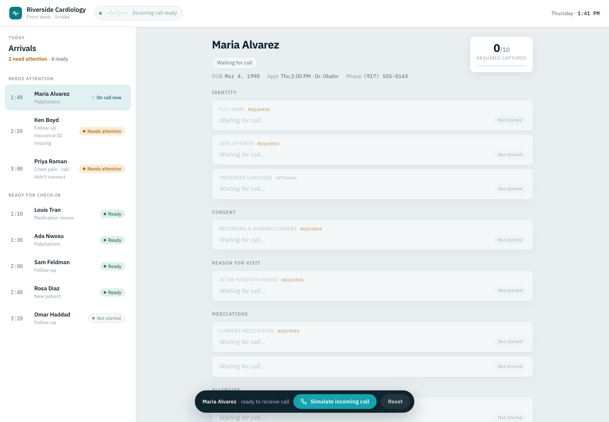
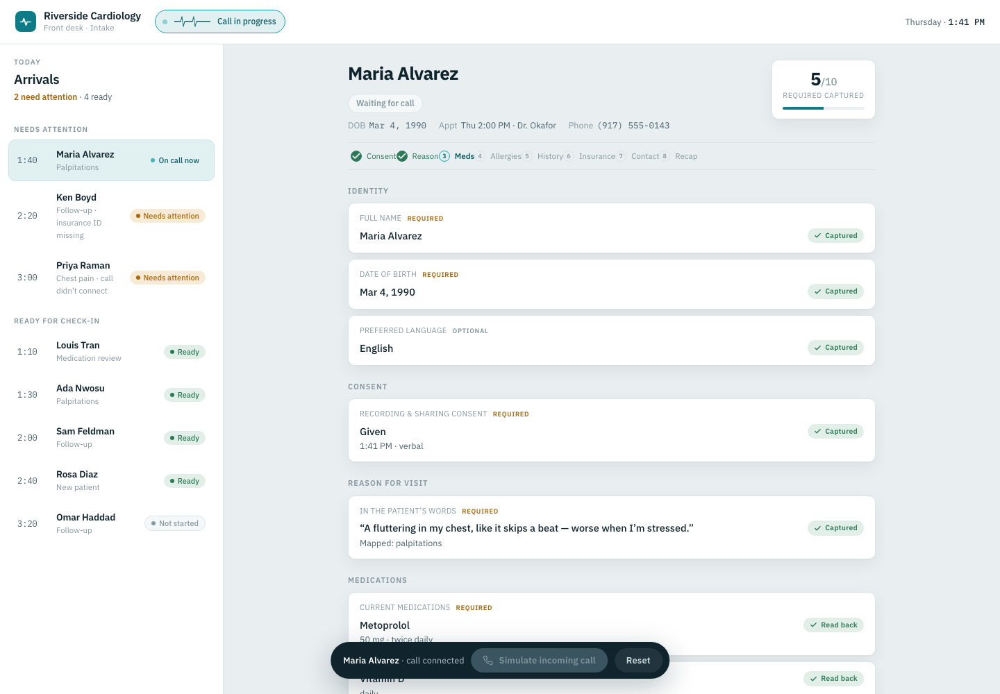
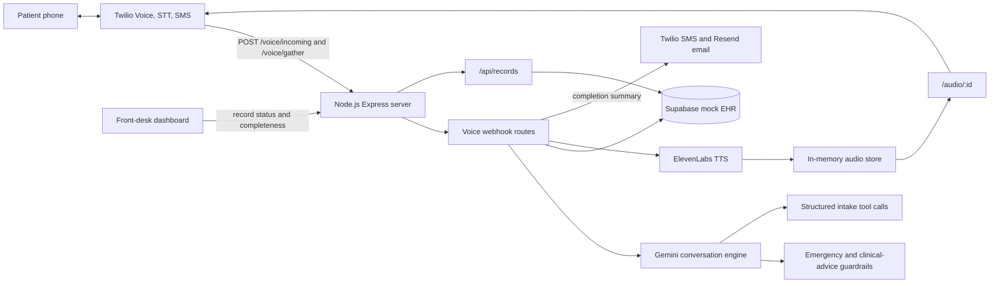
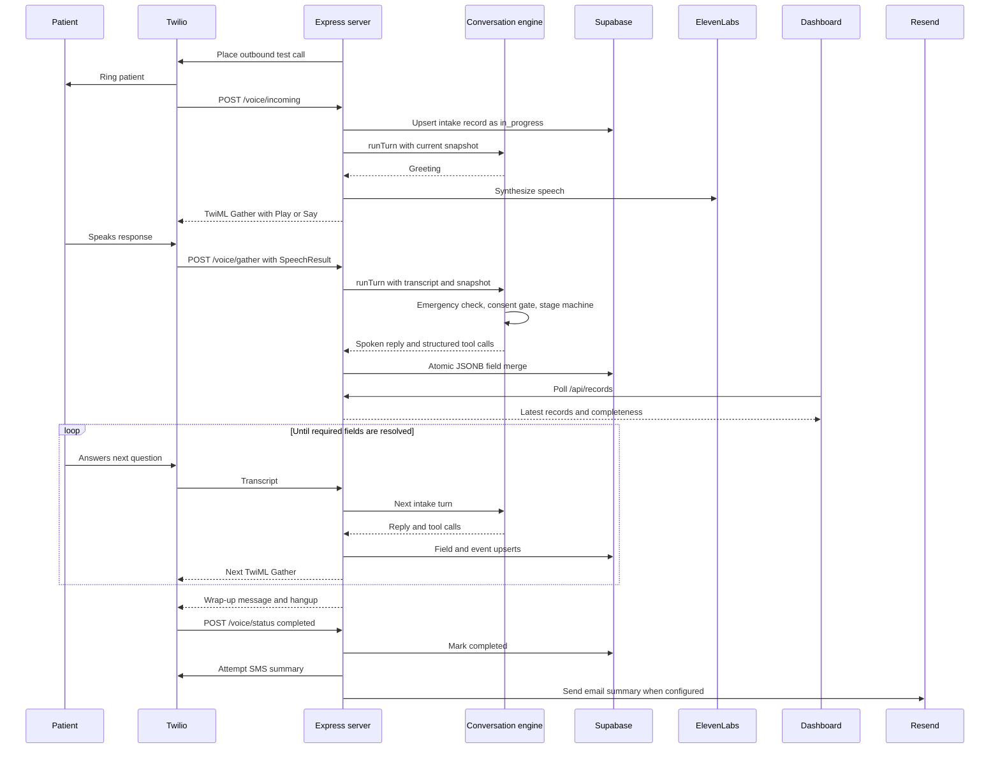

# AryaHack Patient Intake

AI voice intake agent for pre-appointment patient calls, built for AI Healthcare Hack NYC.

The system calls a patient, confirms identity and consent, collects structured intake details over a live phone conversation, writes the result to a mock EHR record, and sends a confirmation summary by SMS or email after the call.

## Why it matters

Patient intake is still often handled through paper forms, portals, or repeated questions at check-in. That creates friction for patients, extra follow-up work for front-desk teams, and incomplete context for clinicians.

This project shows a voice-first intake workflow that completes the chart before the visit while keeping the agent scoped to data collection only: no diagnosis, no treatment advice, consent before medical questions, and emergency escalation messaging.

## Demo

### Front-desk dashboard

Open the dashboard UI:

```text
patient-call-frontend.html
```

The dashboard presents the clinic-facing view for the demo: today's arrivals, call status, required-field progress, missing-field notices, allergies, insurance gaps, and whether a patient is ready for check-in. The **Simulate incoming call** control walks through the visible intake sequence for the Riverside Cardiology sample roster.

Ready state:



Call in progress:



### Live voice intake

Run the backend from `server/` to place a real test call through Twilio. During the call, the agent confirms the patient and appointment, reads the consent script, gathers intake details, extracts structured fields with Gemini tool calls, and persists the record to Supabase.

The live backend dashboard is available at:

```text
http://localhost:3000/
```

It polls `/api/records` every 3 seconds so the mock EHR record can update while the call is in progress.

### Judge walkthrough

1. Show the front-desk dashboard and the patient roster.
2. Start the Express server and expose it with ngrok.
3. Configure the Twilio number to use the ngrok URL.
4. Place an outbound test call with `npm run test-call`.
5. Answer as the patient and provide consent.
6. Give intake details such as chief complaint, medications, allergies, insurance, and emergency contact.
7. Show the mock EHR record updating as structured fields are captured.
8. End the call and show completion status plus confirmation delivery.

SMS is attempted through Twilio. Resend email is also supported and is the more reliable demo confirmation path when carrier SMS compliance blocks delivery.

## Architecture



## End-to-end flow



## Technical highlights

- **Real telephony loop:** Twilio Voice webhooks drive live calls, speech gathering, voicemail handling, status callbacks, and SMS attempts.
- **LLM with deterministic control:** Gemini handles natural conversation and structured tool calls, while code controls greeting, consent, interview, wrap-up, and completion.
- **Consent gate:** medical intake fields are not collected until the patient gives affirmative consent.
- **No silent blanks:** every required field is resolved as `captured`, `patient_declined`, or `unable_to_capture`.
- **Safety guardrails:** emergency keywords are checked before the transcript reaches Gemini; clinical-advice requests are refused instead of answered.
- **Reliable writes:** records are keyed by Twilio `CallSid`; Supabase field updates use an atomic Postgres JSONB merge function.
- **Demo resilience:** async voice handlers return a graceful TwiML apology/hangup on errors, and ElevenLabs TTS falls back to Twilio `<Say>`.
- **Visible proof:** the dashboard shows call status, field completeness, captured values, and required fields that still need attention.

## Tech stack

- Node.js + Express
- Twilio Voice and SMS
- Gemini function/tool calling
- ElevenLabs TTS with Twilio `<Say>` fallback
- Supabase/Postgres
- Resend email confirmations
- ngrok for local HTTPS webhooks
- Static HTML/CSS/JS dashboard UI

## Project map

- `patient-call-frontend.html` - front-desk dashboard experience used in the demo.
- `server/src/index.js` - Express app entry point.
- `server/src/routes/voice.js` - Twilio webhooks, TwiML generation, tool-call persistence, SMS/email completion.
- `server/src/routes/dashboard.js` - `/api/records`, `/api/records/:callSid`, and the lightweight live dashboard route.
- `server/src/routes/audio.js` - serves synthesized ElevenLabs clips for Twilio `<Play>`.
- `server/src/lib/conversation.js` - Gemini conversation engine and intake stage machine.
- `server/src/lib/intakeSchema.js` - single source of truth for intake fields and states.
- `server/src/lib/guardrails.js` - emergency and clinical-advice guardrails.
- `server/src/lib/supabase.js` - record upserts, field merges, event logging, completeness calculation.
- `server/supabase/schema.sql` - mock EHR tables and `merge_intake_field()` RPC.

## Run locally

Install backend dependencies:

```bash
cd server
npm install
```

Apply the database schema once in the Supabase SQL Editor:

```text
server/supabase/schema.sql
```

Create `server/.env`:

```bash
PORT=3000
PUBLIC_BASE_URL=https://your-ngrok-url.ngrok-free.app

TWILIO_ACCOUNT_SID=...
TWILIO_AUTH_TOKEN=...
TWILIO_PHONE_NUMBER=...

GEMINI_API_KEY=...

SUPABASE_URL=...
SUPABASE_SERVICE_ROLE_KEY=...
```

Optional for `npm run test-call` without passing a phone number:

```bash
TEST_PATIENT_PHONE_NUMBER=...
```

The backend also includes a generated demo patient roster. `TEST_PATIENT_PHONE_NUMBER`
is used as the default phone for Maya Rivera; additional fixture numbers can be
overridden when you have more verified test phones:

```bash
DEMO_PATIENT_MAYA_PHONE=...
DEMO_PATIENT_DANIEL_PHONE=...
DEMO_PATIENT_ELENA_PHONE=...
DEMO_PATIENT_ID=pat-maya-rivera
```

The live call flow now seeds the patient profile before dialing, asks for DOB by
keypad verification, then proceeds to consent and intake. Insurance remains
self-reported intake data, not an identity verifier.

Optional text-to-speech. If omitted, the server falls back to Twilio `<Say>`:

```bash
ELEVENLABS_API_KEY=...
ELEVENLABS_VOICE_ID=...
```

Optional confirmation email:

```bash
RESEND_API_KEY=...
CONFIRMATION_EMAIL_TO=...
CONFIRMATION_EMAIL_FROM=onboarding@resend.com
```

`CONFIRMATION_EMAIL_TO` is the configured demo recipient for the confirmation email.

Start the server:

```bash
npm run dev
```

Expose it publicly:

```bash
ngrok http 3000
```

Set `PUBLIC_BASE_URL` to the HTTPS ngrok URL, then configure Twilio:

```bash
node scripts/configure_number.js "$PUBLIC_BASE_URL"
```

Run a live test call:

```bash
npm run test-call
```

Or pass a destination number directly:

```bash
npm run test-call -- +15551234567
```

Open the live dashboard:

```text
http://localhost:3000/
```

## Confirmation behavior

When Twilio posts `completed` to `/voice/status`, the server builds a summary from captured and declined intake fields.

- SMS is attempted through Twilio to the patient phone number on the call record.
- Email is sent through Resend to `CONFIRMATION_EMAIL_TO` when `RESEND_API_KEY` and `CONFIRMATION_EMAIL_TO` are set.
- If SMS delivery is blocked by carrier compliance, the call, persistence, dashboard, and email confirmation path still work.

## Useful smoke tests

```bash
node scripts/test_conversation.js
node scripts/test_supabase.js
node scripts/test_tts.js
```

These scripts call live services, so they require the relevant environment variables and Supabase schema.

## Hackathon scope

This is a hackathon MVP, not a production medical device. It does not diagnose, triage, recommend treatment, verify insurance eligibility, or integrate with a real EHR. Supabase is the mock EHR integration point.

Before production use, the system would need Twilio webhook signature validation, authenticated dashboard access, stricter PHI handling, secure patient messaging instead of PHI over SMS, persistent session/audio storage, monitoring, audit controls, and formal healthcare compliance review.

Full product spec: [PRD.md](./PRD.md). Server details: [server/README.md](./server/README.md).
